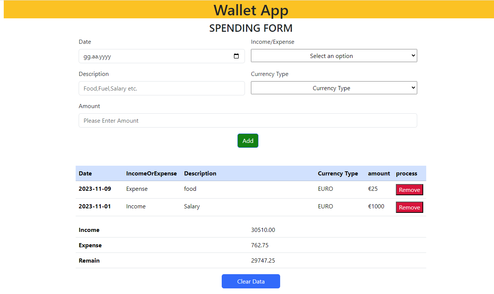

# Wallet App

  
 

## Description

This is a basic wallet application.This project made with javascript,html,pure css.


## Project Skeleton 

```plaintext
02-Wallet App (folder)
|
|----readme.md         # Given to the students (Definition of the project)          
|----solution
        |----index.html  
        |----wallet.js
        |----style.css
```

## Expected Outcome




## Objective
 - When the income form is submitted, the  event listener prevents the page from reloading, adds the income to the total, stores it in local storage, resets the input field, and updates the result table.
 - When the page loads, the load event listener retrieves the income and expense data from local storage, populates the expense table, sets the current date in the date input field, and updates the result table.
 - When the expense form is submitted, the event listener prevents the page from reloading, creates an expense object, adds it to the expense array, stores the array in local storage, populates the expense table, and updates the result table.
 - Function takes an expense object, creates a new row in the expense table, and displays the date, description, and amount of the expense.


<p align='center'> <strong>⌛ Happy Coding  ✍</strong> </p>